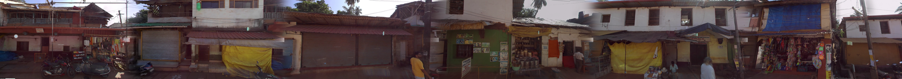
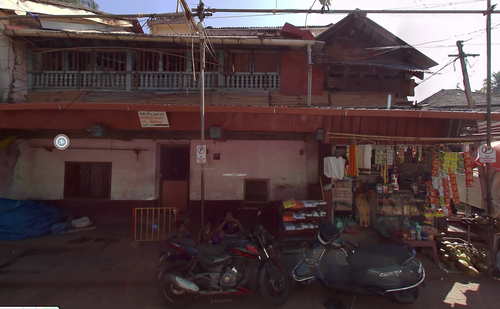
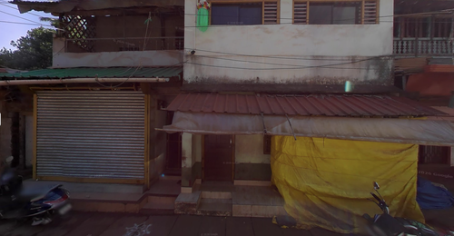
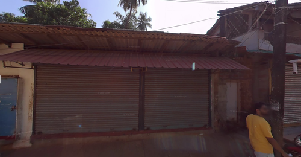
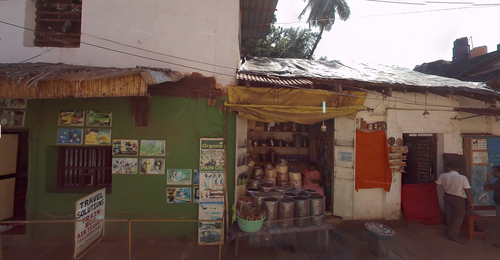
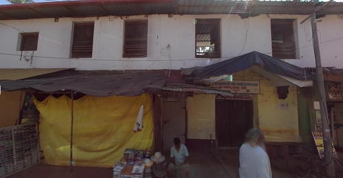
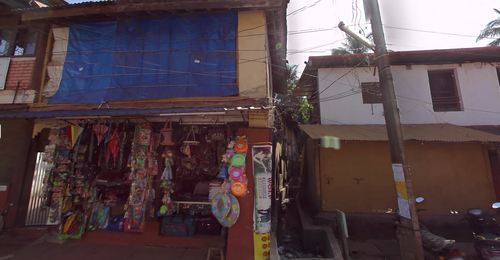

# Street Image Stitcher

Upload Google Street View screenshots, order them left-to-right, and generate a stitched panoramic street elevation.



## Example inputs

Six sequential Street View screenshots of the same street:

| | | |
|---|---|---|
|  |  |  |
|  |  |  |

## How it works

1. Upload up to 12 Street View screenshots
2. Drag to reorder them left-to-right
3. Optionally add a street name and timestamp label
4. The backend stitches them into a full-resolution panorama

**Stitching pipeline (attempt 14):** Resize all images to a common height → normalize brightness to the median luminance across all frames → concat at full resolution → 400px sigmoid cross-fade blend at each seam.

No Gemini — abandoned after attempt 5 due to a hard ~2048px output resolution cap that crops wide panoramas regardless of input size.

## Architecture

1. Frontend gets per-file upload tokens from `POST /api/blob/upload-url`
2. Frontend uploads images directly to Vercel Blob
3. Frontend calls backend `POST /stitch` with blob URLs + optional labels
4. Backend starts a background job and returns `job_id`
5. Frontend polls `GET /status/:job_id` every 3 seconds
6. Backend uploads stitched PNG to Blob and returns `panorama_url`

## Quickstart (local)

### 1) Start backend

```bash
cd backend
cp .env.example .env
pip install -r requirements.txt
uvicorn main:app --reload --port 8000
```

### 2) Start frontend

```bash
cd frontend
cp .env.example .env.local
npm install
npm run dev
```

Set in `frontend/.env.local`:

```
NEXT_PUBLIC_BACKEND_URL=http://localhost:8000
```

Open `http://localhost:3000`.

## Environment variables

### Frontend (`frontend/.env.local`)

| Variable | Description |
|---|---|
| `BLOB_READ_WRITE_TOKEN` | Vercel Blob token (upload token generation + cron cleanup) |
| `NEXT_PUBLIC_BACKEND_URL` | Backend base URL for client job calls |
| `CRON_SECRET` | Bearer auth secret for `GET /api/cron` |
| `RAILWAY_BACKEND_URL` | (optional) Backend URL for keep-alive ping from cron |

### Backend (`backend/.env`)

| Variable | Description |
|---|---|
| `BLOB_READ_WRITE_TOKEN` | Vercel Blob token (upload result PNG, delete input blobs) |
| `ALLOWED_ORIGINS` | Comma-separated CORS origins |
| `GEMINI_API_KEY` | Present for alternate AI flow experiments |

## Deployment

- Frontend → Vercel (`frontend/vercel.json` includes a 5-minute cron on `/api/cron`)
- Backend → Railway (`backend/railway.toml` + `Dockerfile`)

## API

| Endpoint | Description |
|---|---|
| `POST /stitch` | `{ blob_urls, street_name?, timestamp? }` → `{ job_id }` |
| `GET /status/{job_id}` | `{ status: processing\|done\|error, panorama_url? }` |
| `GET /health` | Health check |

## Docs

- [`stitching-attempts.md`](stitching-attempts.md) — full log of all 14 stitching approaches tried, what failed and why
- [`frontend/README.md`](frontend/README.md) — frontend setup and UX flow
- [`backend/README.md`](backend/README.md) — backend API and operations
- [`DESIGN-PLAN.md`](DESIGN-PLAN.md) — product and design intent
